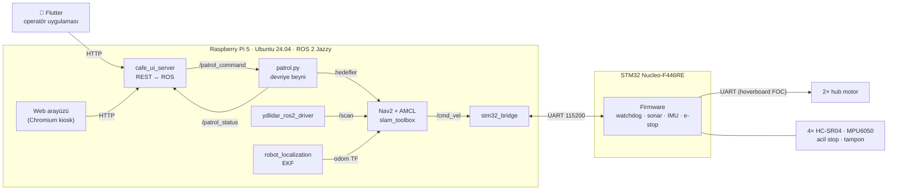
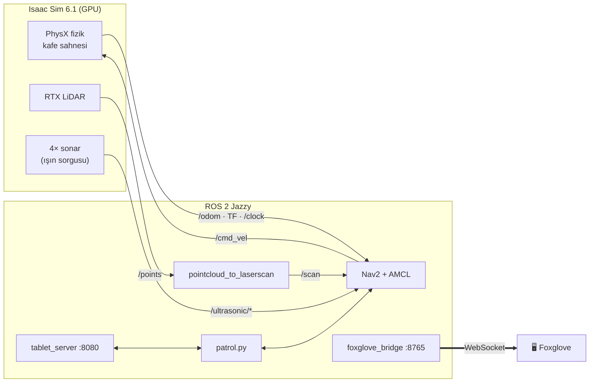
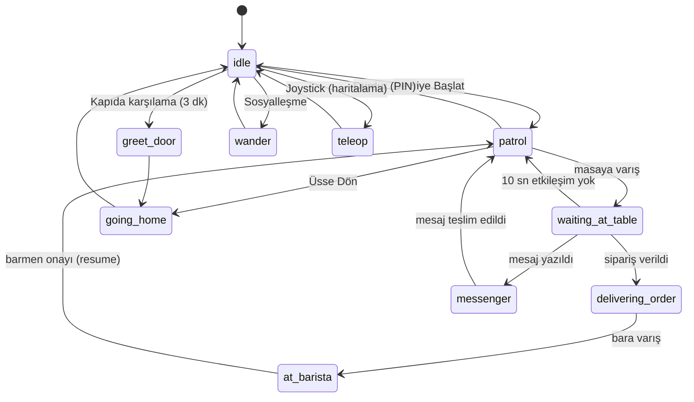

<div align="center">

# 🐝 Cryvex — Otonom Kafe Maskot Robotu

**Masalar arasında devriye gezen, sipariş alan, barmene ileten ve müşterilerle
konuşan otonom bir servis robotu.**

ROS 2 · Nav2 · Isaac Sim · Gazebo · Foxglove · STM32 · Flutter


</div>

---

## İçindekiler

- [Genel bakış](#genel-bakış)
- [Öne çıkan özellikler](#öne-çıkan-özellikler)
- [Sistem mimarisi](#sistem-mimarisi)
- [Depo yapısı](#depo-yapısı)
- [Hızlı başlangıç](#hızlı-başlangıç)
- [Robotun davranışı](#robotun-davranışı)
- [ROS 2 arayüzü](#ros-2-arayüzü)
- [Donanım](#donanım)
- [Güvenlik tasarımı](#güvenlik-tasarımı)
- [Proje durumu](#proje-durumu)

---

## Genel bakış

Cryvex, bir kafede müşteri deneyimini üstlenen bir **maskot servis robotudur**.
Kayıtlı harita üzerinde masaları sırayla dolaşır. Her masada durur ve dokunmatik
ekranındaki yüzüyle müşteriyi karşılar. Menüden sipariş alır, siparişi barmene
götürür, masalar arasında mesaj taşır. Bunları yaparken Türkçe sinir ağı
sesiyle konuşur.

Proje üç katmanda geliştirilir:

| Katman | Amaç | Konum |
|---|---|---|
| **Simülasyon** | Davranışı ve navigasyonu donanım olmadan geliştirmek ve test etmek | `src/` (Gazebo + Isaac Sim) |
| **Gerçek robot** | Raspberry Pi 5 + STM32 üzerinde çalışan ürün yazılımı | `cryvex_hw_ws/` |
| **Operatör uygulaması** | Robotu ağda bulma, izleme, joystick ile sürme, kurulum | `cryvex_app/` (Flutter) |

Simülasyonda test edilen devriye beyni (`patrol.py`) ve web arayüzü gerçek
robota **aynı ROS topic sözleşmesiyle** taşınır.

## Öne çıkan özellikler

- 🗺️ **Otonom navigasyon:** Nav2 + AMCL ile kayıtlı haritada konumlanma.
  Keepout maskesi robotu masa ve sandalye izdüşümlerinden uzak tutar, hız
  maskesi kapı ve mutfak önünde yavaşlatır.
- 🧭 **Sahada haritalama:** operatör ekranındaki "Ortamı Haritala" adımında
  slam_toolbox ile canlı harita çıkarılır. Joystick ile gezilir, harita
  kaydedilir, ardından masa, kapı ve barmen noktaları ekrandan işaretlenir.
- 🧠 **Durum makinesi tabanlı devriye beyni:** devriye, masada bekleme,
  sipariş teslimi, mesaj taşıma, kapıda karşılama, sosyalleşme ve kurtarma
  modları.
- 😊 **Etkileşimli yüz arayüzü:** göz animasyonları, geri sayım halkası,
  kategorili menü, sipariş fişi ve masalar arası mesajlaşma.
- 🔊 **Türkçe ses:** çevrimiçiyken Azure Neural TTS (edge-tts), internet
  yoksa tamamen çevrimdışı çalışan **Piper** yedek sesi.
- 🎮 **Operatör uygulaması (Flutter):** robotu yerel ağda otomatik bulma,
  canlı durum, sanal joystick ve kurulum ekranı.
- 🧪 **İki simülatör:** hafif **Gazebo** (dizüstünde) ve fotogerçekçi
  **NVIDIA Isaac Sim 6.1** (RTX LiDAR, PhysX). İkisi de aynı ROS arayüzünü
  yayınlar.
- 📊 **Foxglove ile görselleştirme:** harita, LiDAR, planlanan yollar,
  costmap'ler, devriye durumu ve kontrol butonları tek ekranda. Yerelde ya da
  uzaktan izlenebilir.
- 🛡️ **Katmanlı güvenlik:** STM32 donanım watchdog'u, acil stop, tampon
  anahtarları, ultrasonik yakın mesafe algılama ve Nav2 collision monitor.

## Sistem mimarisi

### Gerçek robot



### Simülasyon (Isaac Sim + ROS 2 → Foxglove)



Gazebo ve Isaac Sim **aynı topic ve frame adlarını** kullanır. Bu sayede
devriye beyni, harita, masa kurulumu ve Nav2 ayarları simülatörler arasında
değişmeden çalışır.

## Depo yapısı

```
cryvex_ws/
├── src/                          # Simülasyon çalışma alanı (colcon)
│   ├── cryvex_description/       # Robot modeli (URDF/xacro)
│   ├── cryvex_gazebo/            # Gazebo kafe dünyası, Nav2 ayarları, haritalar,
│   │   ├── scripts/              #   patrol.py (devriye beyni), tablet_server.py
│   │   ├── web/                  #   Dokunmatik yüz + kurulum arayüzü
│   │   ├── config/               #   nav2_params.yaml (Humble), nav2_params_jazzy.yaml
│   │   ├── maps/                 #   Kafe haritası, keepout ve hız maskeleri
│   │   └── worlds/cafe.world     #   17×14 m kafe (8 masa, bar, kolonlar)
│   └── cryvex_isaac/             # Isaac Sim 6.1 simülasyonu + Foxglove
│       ├── isaac/                #   run_cafe_sim.py, SDF→USD dönüştürücü
│       ├── foxglove/             #   Hazır Foxglove düzeni
│       └── docker/               #   Isaac + ROS Jazzy docker compose
├── cryvex_hw_ws/                 # Gerçek robot
│   ├── src/cryvex_bringup/       #   Donanım başlatma, stm32_bridge, patrol, UI sunucusu
│   ├── src/ydlidar_ros2_driver/  #   YDLIDAR T-mini Plus sürücüsü
│   ├── stm32_firmware/           #   STM32CubeIDE projesi (HAL, C)
│   ├── docs/                     #   Kurulum playbook'u, seri protokol, CubeMX pinleri
│   ├── system/                   #   systemd servisi, kiosk oturumu
│   └── Dockerfile                #   Pi dışında Jazzy geliştirme ortamı
└── cryvex_app/                   # Flutter operatör uygulaması (Android/iOS/masaüstü)
```

## Hızlı başlangıç

### 1) Gazebo simülasyonu (dizüstü · Ubuntu 22.04 · ROS 2 Humble)

```bash
cd ~/cryvex_ws
colcon build --symlink-install
source install/setup.bash
ros2 launch cryvex_gazebo bringup.launch.py
```

Tek komutla Gazebo, robot, Nav2, devriye beyni, tablet arayüzü ve Foxglove
köprüsü başlar.

| Arayüz | Adres |
|---|---|
| Robot yüzü / yönetici paneli | http://localhost:8080 |
| Foxglove | [app.foxglove.dev](https://app.foxglove.dev/?ds=foxglove-websocket&ds.url=ws%3A%2F%2Flocalhost%3A8765) → `ws://localhost:8765` |
| Foxglove düzeni | `src/cryvex_isaac/foxglove/cryvex_layout.json` (*Layouts → Import from file*) |

### 2) Isaac Sim simülasyonu (NVIDIA RTX GPU'lu makine)

> Gereksinim: RTX 4080 (16 GB VRAM) veya üstü, 32 GB RAM, NVIDIA sürücüsü ≥ 595.58,
> NVIDIA Container Toolkit, Docker Compose.

```bash
cd ~/cryvex_ws/src/cryvex_isaac/docker
./up.sh                              # ekransız
ISAAC_MODE=--livestream ./up.sh      # Isaac görüntüsünü WebRTC ile izlemek için
```

Ayrıntılar: [`src/cryvex_isaac/README.md`](src/cryvex_isaac/README.md)

### 3) Gerçek robot (Raspberry Pi 5 · Ubuntu 24.04 · ROS 2 Jazzy)

Adım adım kurulum (işletim sistemi imajı, STM32'ye yazılım yükleme, udev
kuralları, systemd servisi, kiosk ekranı):
[`cryvex_hw_ws/docs/kurulum_playbook.md`](cryvex_hw_ws/docs/kurulum_playbook.md)

```bash
ros2 launch cryvex_bringup hardware_bringup.launch.py   # sensörler + STM32 + EKF + UI
```

### 4) Operatör uygulaması

```bash
cd cryvex_app
flutter pub get
flutter run
```

## Robotun davranışı



Temel kurallar:

- Sipariş yalnızca robot bir masada beklerken alınır. Menü açıkken bekleme
  süresi durur.
- Robot barmenin yanından **onay gelmeden ayrılmaz**, sipariş yarıda kalmaz.
- Sipariş taşınırken, onu bölecek komutlar reddedilir.
- Devriyeyi durdurmak 4 haneli yönetici PIN'i ister.
- Hedef bir engelle çakışırsa robot, yakındaki boş bir noktaya kendiliğinden
  yeniden dener. Sıkışırsa kurtarma manevrası yapar.

## ROS 2 arayüzü

| Topic | Tip | Yön | Açıklama |
|---|---|---|---|
| `/patrol_command` | `std_msgs/String` | → patrol | `start`, `stop`, `go_home`, `wander`, `greet_door`, `resume`, `order:<json>`, `teleop:<v>:<w>` … |
| `/patrol_status` | `std_msgs/String` (JSON) | patrol → | durum, hedef masa, geri sayım, konuşma, sipariş, mesaj |
| `/cmd_vel` | `geometry_msgs/Twist` | → taban | hız komutu |
| `/scan` | `sensor_msgs/LaserScan` | sensör → | 2D LiDAR (simde `/points`'ten türetilir) |
| `/ultrasonic/{fl,fr,rl,rr}` | `sensor_msgs/Range` | sensör → | 4× HC-SR04 |
| `/odom` · TF `odom→base_footprint` | `nav_msgs/Odometry` | taban → | teker odometrisi (gerçek robotta EKF ile) |
| `/map` | `nav_msgs/OccupancyGrid` | map_server → | kayıtlı ya da canlı harita |

## Donanım

| Bileşen | Seçim |
|---|---|
| Ana bilgisayar | Raspberry Pi 5 (4 GB) |
| Alt seviye denetleyici | STM32 Nucleo-F446RE |
| LiDAR | YDLIDAR T-mini Plus (2D, 360°, 12 m) |
| IMU | MPU6050 (planlı, henüz takılı değil; yazılım IMU olmadan da çalışır) |
| Tahrik | 2× hoverboard hub motor, FOC sürücü (UART) |
| Yakın mesafe | 4× HC-SR04 ultrasonik |
| Güç | 24 V 30 Ah LiFePO4 |
| Güvenlik | Acil stop butonu + röle, tampon anahtarları |
| Arayüz | 7" HDMI dokunmatik ekran, USB ses kartı + PAM8610 amfi |

Pi 5 ↔ STM32 seri protokolü: [`cryvex_hw_ws/docs/stm32_protokol.md`](cryvex_hw_ws/docs/stm32_protokol.md) ·
CubeMX pin tablosu: [`cryvex_hw_ws/docs/stm32_cubemx_ayarlari.md`](cryvex_hw_ws/docs/stm32_cubemx_ayarlari.md)

## Güvenlik tasarımı

Güvenlik tek bir yazılım katmanına bırakılmaz. Her katman bir üstündekinden
bağımsız olarak robotu durdurabilir:

1. **STM32 watchdog (200 ms):** Pi'den 200 ms boyunca komut gelmezse motorlar
   koşulsuz durur. Linux çökse bile bu kural geçerlidir.
2. **Acil stop ve tamponlar:** NC kontaklar doğrudan STM32'de okunur,
   motor komutu donanım seviyesinde kesilir.
3. **Seri köprü zaman aşımı:** 0,5 s boyunca yeni `/cmd_vel` gelmezse
   STM32'ye sıfır hız gönderilir.
4. **Nav2 collision monitor + ultrasonik costmap katmanı:** LiDAR'ın
   göremediği alçak ya da cam engellerde yavaşlama ve durma.
5. **Devrilme önlemi:** ivme ve fren sınırları düşük tutulur, uzun gövde ani
   frende öne yatmaz.

## Proje durumu

| Alan | Durum |
|---|---|
| Gazebo simülasyonu (devriye, sipariş, mesaj, haritalama) | ✅ Çalışıyor |
| Nav2 Jazzy'ye geçiş | ✅ Tamamlandı |
| STM32 firmware (gerçek kartta) | ✅ Çalışıyor |
| Isaac Sim 6.1 + Foxglove | 🟡 ROS tarafı uçtan uca test edildi, GPU'da ilk çalıştırma bekliyor |
| Operatör uygulaması (Flutter) | 🟡 Geliştiriliyor |
| Gerçek robotta tam otonom devriye | 🔜 Motor sürücüsü ve şasi montajı bekleniyor |

---

<div align="center">

Geliştiren: **Mustafa Ali İmre** · [imre-robotics](https://github.com/imre-robotics)

</div>
