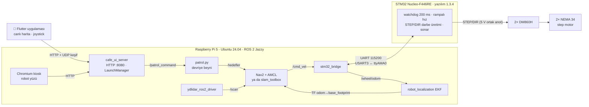
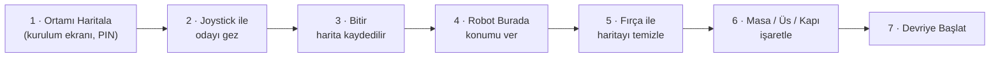

# 🤖 Cryvex Gerçek Robot — Donanım, Kablolama, Kalibrasyon ve Sorun Giderme

Bu belge, Cryvex'in **fiziksel robot** tarafını uçtan uca anlatır:
- hangi parçaların kullanıldığı ve nasıl bağlandığı,
- STM32 yazılımının ve Raspberry Pi tarafının nasıl çalıştığı,
- robotun ölçülerinin nasıl kalibre edildiği,
- sahada yaşanan sorunlar ve kök nedenleri.

Simülasyon için ana [README](../../README.md) dosyasına, sıfırdan Pi kurulumu için
[`kurulum_playbook.md`](kurulum_playbook.md) dosyasına bakın.

> Son güncelleme: **2026-10-08** · STM32 yazılımı **1.3.4** · ROS 2 **Jazzy** · Nav2 **1.3**

> 🔀 **8 Ekim birleştirmesi:** 5–8 Ekim arasında robot üzerinde yapılan çalışma
> (LiDAR yeniden takıldı, kamera + YOLO algılama, LiDAR odometrisi, kendi sürüş
> ve güvenlik kapısı, HOME → Masa → HOME görevi) bu depoya birleştirildi.
> Ayrıntılar: [`../cryvex_araclar/README.md`](../cryvex_araclar/README.md) ve
> [`GUNLUK.md`](GUNLUK.md). Bu belgede değeri değişen yerler **(8 Ekim)** ile işaretlidir.

> ⚠️ **Güvenlik (8 Ekim):** Acil stop (A1) ve tampon (A0) girişleri geçici
> olarak GND'ye köprülü, yani **donanımsal güvenlik devre dışı**. Robot
> insanların arasına çıkmadan önce gerçek NC düğmeler bağlanmalı.

---

## İçindekiler

1. [Mevcut durum](#1-mevcut-durum)
2. [Donanım listesi](#2-donanım-listesi)
3. [Mimari](#3-mimari)
4. [Kablolama](#4-kablolama)
5. [STM32 yazılımı](#5-stm32-yazılımı)
6. [Raspberry Pi yazılımı](#6-raspberry-pi-yazılımı)
7. [Geometri ve kalibrasyon](#7-geometri-ve-kalibrasyon)
8. [Konumlama ve haritalama ayarları](#8-konumlama-ve-haritalama-ayarları)
9. [Operatör iş akışı](#9-operatör-iş-akışı)
10. [HTTP arayüzü](#10-http-arayüzü)
11. [Sorun giderme günlüğü](#11-sorun-giderme-günlüğü)
12. [Bakım ve geliştirme komutları](#12-bakım-ve-geliştirme-komutları)
13. [Açık işler](#13-açık-işler)

---

## 1) Mevcut durum

| Alan | Durum | Not |
|---|---|---|
| STM32 ↔ Pi haberleşmesi | ✅ Çalışıyor | Doğrudan UART (USART3 ↔ `ttyAMA0`), 115200 baud |
| Motorlar (2× DM860H + 2× NEMA 34 step) | ✅ Çalışıyor | Telefon joystick'i ve Nav2 ile sürüldü |
| Teker odometrisi | 🟡 Sınırlı | Step motor adım kaçırınca odometri bunu bilmiyor (enkoder yok) **(8 Ekim)** |
| LiDAR konumu (dış kalibrasyon) | 🟡 Yeniden takıldı | 36 cm yükseklik, x 0,125 · y −0,045 · −90°; ICP ile yeniden doğrulanmalı **(8 Ekim)** |
| EKF (odom → base_footprint) | ✅ | İleri hız tekerden, dönüş LiDAR odometrisinden (rf2o) **(8 Ekim)** |
| SLAM (slam_toolbox) | 🟡 | Takılma/teker kayması olunca harita hâlâ dönebiliyor; çözüm enkoder + IMU |
| Kamera + YOLO algılama | ✅ | Brio 100 + ±180° taret, YOLO11n ~6 kare/sn, canlı yayın `:8081` **(8 Ekim)** |
| HOME → Masa → HOME görevi | ✅ İlk başarı | 8 Ekim, masaya 35 cm, HOME'a dönüş < 1 cm **(8 Ekim)** |
| Acil stop / tampon | ❌ Köprülü | Geçici olarak GND'ye bağlı **(8 Ekim)** |
| Bilgisayarsız açılış | ✅ Çalışıyor | Güç verildikten ~40 sn sonra hazır |
| Telefon uygulaması: canlı harita | ✅ Hazır | APK robottan indirilir: `http://<robot>:8080/cryvex.apk` |
| Otonom devriye (gerçek kafede) | 🔜 Sahada test | Yeni haritadan sonra masalar işaretlenecek |
| Batarya + JK BMS | 🔜 Bekliyor | Şimdilik 24 V güç kaynağıyla tezgâhta çalışıyor |
| Ultrasonik sensörler | ⏸️ Takılı değil | URDF'te yer tutucu çerçeveler var; yerine VL53L1X ToF planlı |
| IMU (MPU6050) | ⏸️ Takılı değil | Yazılım IMU olmadan çalışacak şekilde ayarlı |

---

## 2) Donanım listesi

| Bileşen | Model | Not |
|---|---|---|
| Ana bilgisayar | Raspberry Pi 5 (4 GB) | Ubuntu Server 24.04, ROS 2 Jazzy |
| Alt seviye denetleyici | STM32 Nucleo-F446RE | Motor darbeleri, watchdog, sonar, acil stop |
| Motor sürücü | 2× **DM860H** | STEP/DIR girişli, optokuplörlü, 24–80 V |
| Motor | 2× **86HS156-5608A14-B35** (NEMA 34) | 8 kablo, fabrikada 4 uca birleştirilmiş |
| Teker | 2× Ø150 mm | Teker ortaları arası **540 mm**; sol teker 5 Ekim'de mile kamalandı |
| Gövde | Ø520 mm daire | Tekerden tekere **590 mm** (Nav2 yarıçapı 0,30 m) |
| LiDAR | YDLIDAR **T-mini Plus** | 360°, 12 m, 7 Hz, 614 ışın; doğrudan Pi'nin USB'sine; yerden **36 cm** |
| Kamera **(8 Ekim)** | Logitech **Brio 100** | NEMA 23 taret üstünde, Leadshine **DMA860H** sürücü (6400 adım), Pi GPIO pin 11/13/9; **±180°, asla tam tur** (kablo) |
| Motor güç kaynağı (tezgâh) | Omron **S8VK-C24024** | 24 V 10 A |
| Batarya (planlı) | 24 V 24 Ah LiFePO4 + **JK BMS** (Bluetooth) | BMS'ten pil göstergesi yapılacak |
| Yakın mesafe | 4× HC-SR04 | **Fiziksel olarak takılı değil**; alışveriş listesinde VL53L1X ToF, AS5600 enkoder, ICM-20948 IMU ([liste](robot_alisveris_listesi.md)) |
| Ekran | HDMI dokunmatik (kiosk) + tablet (geliştirici ekranı) | 17" dokunmatik ekran planlı |

---

## 3) Mimari



**TF ağacı:** `map → odom → base_footprint → base_link → {lidar_link, sonar_*_link, imu_link}`

| Dönüşüm | Yayınlayan |
|---|---|
| `map → odom` | Haritalarken **slam_toolbox**, devriyede **AMCL** (ikisi aynı anda asla çalışmaz) |
| `odom → base_footprint` | **EKF** (`ekf_filter_node`) |
| `base_footprint → …` | **robot_state_publisher** ([`cryvex_real.urdf.xacro`](../src/cryvex_bringup/urdf/cryvex_real.urdf.xacro)) |

---

## 4) Kablolama

> ⚠️ **Kablo takıp çıkarmadan önce Pi'nin ve motor güç kaynağının fişini çekin.**
> Kurulum sırasında yaşanan tek bir 5 V kısa devresi Pi'yi çökertti ve
> Nucleo'nun USB seri köprüsünü (ST-LINK VCP) kalıcı olarak bozdu (bkz.
> [§11](#11-sorun-giderme-günlüğü)).

### 4.1 Güç

```
Şebeke ──► Omron S8VK-C24024 (L / N)
               │ +V ──► DM860H #1 +Vdc ─┐
               │ +V ──► DM860H #2 +Vdc  │  (her sürücüye ayrı kablo)
               │ −V ──► DM860H #1 GND   │
               │ −V ──► DM860H #2 GND ──┘
Pi 5 ──► kendi 5 V USB-C adaptörü · STM32 ──► Pi'nin USB'si (yalnızca besleme + SWD yükleme)
```

- DM860H **en az 24 V** ister. Bu yüzden yazılımdaki "pil düşük" eşiği **23,5 V**'tur.
  Altına düşünce robot durur ve uyarır.
- Pil ölçümü **5 V'un altındaysa "pil takılı değil"** sayılır ve robot durdurulmaz.
  Böylece güç kaynağıyla tezgâhta çalışırken sahte "pil bitti" durması olmaz.

### 4.2 Motor ↔ DM860H

Motorun 8 kablosu fabrikada çiftler halinde birleştirilmiş, 4 uç çıkıyor. Aynı
renkteki iki uç aynı bobindir (ölçüm: aynı renk ≈ 0 Ω, zıt renk açık devre).

| Motor ucu | DM860H |
|---|---|
| Kırmızı çift | **A+ / A−** |
| Mavi çift | **B+ / B−** |

Bir motor ters dönerse kablo değiştirmek gerekmez; yazılımda tek bir ayarla
çevrilir (`*_WHEEL_DIR_INVERT`, bkz. [§5](#5-stm32-yazılımı)).

### 4.3 DM860H DIP anahtarları (iki sürücüde aynı)

| Anahtar | Konum | Anlamı |
|---|---|---|
| SW1, SW2, SW3 | ON, ON, OFF | 5,14 A tepe / **4,28 A RMS** |
| SW4 | OFF | Dururken yarım akım (ısınmayı azaltır) |
| SW5, SW6, SW7, SW8 | OFF, OFF, ON, ON | **3200 adım/tur** (yazılımdaki `STEPS_PER_REV` ile aynı olmalı) |

Mikroadımı değiştirirseniz yazılımdaki `STEPS_PER_REV` değerini de aynı sayıya
getirin. Aksi halde robot, komut verilen hızın katı ya da kesri hızla gider.

### 4.4 STM32 ↔ DM860H (sinyal)

Sürücü girişleri optokuplörlüdür. **Ortak anot** bağlantısı kullanılır:
- Altı "+" ucunun hepsi (PUL+, DIR+, ENA+ × 2 sürücü) birleştirilip Nucleo'nun **5 V** pinine gider.
- "−" uçları ayrı ayrı STM32 pinlerine gider.
- STM32 pinleri **open-drain** çalışır: pin LOW olunca optokuplörden akım geçer.

| Nucleo (Arduino adı) | STM32 pini | → | Sürücü |
|---|---|---|---|
| 5V | — | → | 6 adet **+** ucu (birleşik) |
| **D12** | PA6 | → | Sol **PUL−** |
| **D8** | PA9 | → | Sol **DIR−** |
| **D10** | PB6 | → | Sağ **PUL−** |
| **D2** | PA10 | → | Sağ **DIR−** |
| — | — | — | **ENA−** uçları **boş** (sürücü kendiliğinden etkin) |

Nucleo kartında "PA6" gibi adlar yazmaz. Sağdaki dişi soketlerin yanındaki
**D2 / D8 / D10 / D12** yazılarını kullanın.

### 4.5 STM32 ↔ Raspberry Pi 5 (UART)

Nucleo'nun USB seri köprüsü bozulduğu için Pi ile **3 kabloyla doğrudan UART**
üzerinden haberleşilir. USB kablosu yalnızca besleme ve yazılım yükleme (SWD)
için takılı kalır.

| Nucleo | → | Pi 5 (40 pinli başlık) |
|---|---|---|
| **PC10** (USART3 TX) | → | **Pin 10** (GPIO15 / RXD) |
| **PC11** (USART3 RX) | → | **Pin 8** (GPIO14 / TXD) |
| **GND** | → | **Pin 6** (GND) |

> ⚠️ Pi başlığının dış sırasındaki **pin 2 ve pin 4 = 5 V**'tur. 5 V'un bir
> STM32 pinine değmesi kartı yakar. Kablolar dış sırada 3., 4. ve 5. pinlere
> (6, 8, 10) gider.

Pi tarafında yapılan ayarlar:
- `/boot/firmware/cmdline.txt` içinden `console=serial0,…` kaldırıldı. Linux
  konsolu bu portu kullanırsa STM32'ye çöp veri gider.
- `serial-getty@ttyAMA0` maskelendi.
- udev kuralı `ttyAMA0`'ı `/dev/cryvex_stm32` adıyla sabitler
  ([`99-cryvex-serial.rules`](../udev_rules/99-cryvex-serial.rules)).

### 4.6 LiDAR

T-mini Plus **doğrudan Pi'nin USB portuna** takılır. Beslemesiz (pasif) bir USB
çoklayıcının arkasında LiDAR sürekli zaman aşımına düştü. Çoklayıcı gerekirse
**harici beslemeli** olmalıdır.

LiDAR gövdenin en yüksek noktasına, merkezden kaçık ve dönük takılıdır. Konumu
ve açısı ölçülerek URDF'e işlenmiştir (bkz. [§7](#7-geometri-ve-kalibrasyon)).

---

## 5) STM32 yazılımı

Proje: [`stm32_firmware/`](../stm32_firmware) (STM32CubeIDE, HAL, C).
Seri protokol: [`stm32_protokol.md`](stm32_protokol.md).

### 5.1 Önemli ayarlar ([`app_config.h`](../stm32_firmware/Core/Inc/app_config.h))

| Ayar | Değer | Açıklama |
|---|---|---|
| `FW_VERSION` | `"1.3.4"` | Pi tarafı açılışta okur ve kaydeder |
| `PI_LINK_USART3` | `1` | Pi bağlantısı USART3 (PC10/PC11). `0` = eski USB VCP (USART2) |
| `WATCHDOG_TIMEOUT_MS` | `200` | Pi 200 ms komut göndermezse motorlar **koşulsuz** durur |
| `WHEEL_DIAMETER_MM` | `150` | Ölçüldü (LiDAR testi 148 mm buldu) |
| `WHEEL_BASE_MM` | `540` | Teker ortaları arası, ölçüldü |
| `STEPS_PER_REV` | `3200` | DM860H SW5–8 ile aynı |
| `MAX_LINEAR_MM_S` / `MAX_ANGULAR_MRAD_S` | `400` / `1200` | 0,4 m/s · 1,2 rad/s |
| `MAX_ACCEL_MM_S2` | `300` | Rampa: ani kalkış/fren yok, uzun gövde devrilmez |
| `MOTOR_EN_ACTIVE_LOW` | `0` | ENA bağlı değil |
| `LEFT_/RIGHT_WHEEL_DIR_INVERT` | `0` / `0` | Gövdeye takılı haldeki yönler (1.3.3'te düzeltildi) |
| `BATT_LOW_MV` | `23500` | Pil düşük eşiği (Pi tarafında da aynı) |

**Pin yapısı:**
- STEP/DIR pinleri open-drain sürülür (`motor_pins_open_drain()`).
- Ortak anot bağlantısında "aktif" seviye LOW olduğu için zamanlayıcı PWM çıkışının kutbu ters çevrilmiştir (`CCER.CC1P`).

**UART:** USART3 kesmeyle okunur. Hat hatasında (`HAL_UART_ErrorCallback`)
alım kendiliğinden yeniden başlar; tek bir bozuk bayt haberleşmeyi
kilitlemez.

### 5.2 Derleme ve yükleme

```bash
# Geliştirme bilgisayarında (STM32CubeIDE'nin GCC 14 araç zinciri PATH'te İLK sırada olmalı;
# sistemdeki eski arm-none-eabi-gcc 10 bu projeyi derleyemez)
export PATH=<CubeIDE>/plugins/…gnu-tools-for-stm32.14.3…/tools/bin:$PATH
cd stm32_firmware/Debug && make -j8 all
arm-none-eabi-objcopy -O binary cryvex_stm32.elf cryvex_stm32.bin

# .bin dosyasını Pi'ye kopyalayın, sonra Pi üzerinde (Nucleo USB ile Pi'ye takılı):
st-flash --reset write cryvex_stm32.bin 0x08000000
```

> `st-util` ile hata ayıklarken `-n` kullanın; aksi halde bağlanırken kart sıfırlanır.

---

## 6) Raspberry Pi yazılımı

### 6.1 Açılış zinciri

Pi'ye güç verildiğinde bilgisayara gerek kalmadan her şey kendiliğinden kalkar
(ölçülen süre **~40 sn**):

1. **`cryvex-bringup.service`** ([dosya](../system/cryvex-bringup.service)):
   - Önce [`cryvex_ros_cleanup.sh`](../system/cryvex_ros_cleanup.sh) çalışır ve kalıntı ROS süreçleriyle bozuk Fast DDS paylaşımlı bellek dosyalarını temizler.
   - Ardından `hardware_bringup.launch.py` açılır: LiDAR, stm32_bridge, EKF, robot_state_publisher, cafe_ui_server ve patrol.
   - Durdururken önce **SIGINT** gönderilir ve 20 sn beklenir; çıkışta temizlik tekrar çalışır.
2. **Kiosk ekranı:** tty1 otomatik giriş → `startx` → Chromium tam ekran robot yüzü.
3. **cafe_ui_server** kayıtlı harita varsa Nav2'yi (AMCL ile) başlatır ve
   robotu son bilinen konumuna yerleştirir.
4. **Nav2 açılış bekçisi:**
   - Nav2'nin bütün düğümleri 75 sn içinde "aktif" olmazsa Nav2 kapatılıp yeniden açılır (en fazla 3 deneme).
   - Durum ekranda "konum sistemi açılıyor / AÇILAMADI" olarak görünür.

### 6.2 Ağ

| Port | Protokol | Ne |
|---|---|---|
| 8080 | HTTP | Robot yüzü (`/`), kurulum ekranı (`/setup`), REST API, canlı harita, APK |
| 47474 | UDP | Keşif: uygulama ağa `CRYVEX?` yayını yapar, robot adresiyle cevap verir |

Telefon uygulaması robotun IP adresini bilmeden bulur. Pi'nin IP'si
değişse de bağlantı kurulur.

### 6.3 Başlıca düğümler

| Düğüm | Görev |
|---|---|
| `stm32_bridge` | `/cmd_vel` → STM32 hız komutu. STM32 durum satırları → `/wheel/odom`, `/ultrasonic/*`, pil voltajı. Pil eşikleri burada uygulanır. |
| `ekf_filter_node` | `/wheel/odom` → `odom → base_footprint` TF |
| `ydlidar_ros2_driver_node` | `/scan` (614 ışın, 7 Hz) |
| `cafe_ui_server` | HTTP sunucusu. Haritalama ile navigasyon arasında geçişi yönetir (LaunchManager). Canlı haritayı çizer, haritayı düzenler. |
| `patrol_command_listener` (patrol.py) | Devriye durum makinesi, joystick (teleop), güvenlik kilitleri |
| Nav2 yığını | AMCL, planlayıcı, DWB denetleyici, collision_monitor, velocity_smoother |

---

## 7) Geometri ve kalibrasyon

### 7.1 Ölçülen değerler

| Büyüklük | Değer | Nerede |
|---|---|---|
| Teker çapı | 150 mm | `app_config.h` |
| Teker ortaları arası | 540 mm | `app_config.h`, `stm32_bridge.py` (`WHEEL_BASE_M`) |
| Robot yarıçapı (Nav2) | 0,30 m | `nav2_params.yaml` (yerel + genel), URDF `footprint_radius` |
| Şişirme yarıçapı | 0,50 m | `nav2_params.yaml` |
| LiDAR konumu (`base_link`'e göre) **(8 Ekim)** | x = 0,125 m · y = −0,045 m · z = 0,36 m | URDF |
| LiDAR açısı **(8 Ekim)** | **−90°** | URDF `lidar_yaw` |
| "Ön" yön **(8 Ekim)** | Kameranın baktığı taraf | 3 Ekim'de ters çevrildi: `stm32_bridge.py` ileri komutunun işaretini çevirir ve sol/sağ teker sayaçlarını yer değiştirir (`YON_DUZELTME`). STM32 yazılımı değişmedi. |
| Dönüş için etkin iz genişliği **(8 Ekim)** | 0,549 m | `stm32_bridge.py` `ODOM_WHEEL_BASE_M`; dönüş komutu kazancı `ANGULAR_CMD_GAIN` 1,02 |

### 7.2 Yöntem: LiDAR'ı cetvel olarak kullanmak

Metreyle ölçmek yerine robotun kendi LiDAR'ı referans alındı. Durağan bir
ortamda iki kısa test yapılır, `/scan` ve `/wheel/odom` kaydedilir, ardından
bilgisayarda 2B **ICP** (tarama eşleştirme) ile analiz edilir:

1. **Yerinde dönüş (+90°, bekle, −90°):**
   - ICP'nin bulduğu dönüş açısı, teker odometrisinin söylediği açıyla karşılaştırılır.
   - Robot dönerken LiDAR'ın kendi etrafında çizdiği yay, LiDAR'ın gövdedeki **x/y konumunu** verir.
2. **Düz ileri–geri (0,39 m):**
   - LiDAR çerçevesinde görülen hareketin yönü, LiDAR'ın gövdeye göre **açısını** verir.
   - Hareketin uzunluğu ileri yöndeki **ölçek hatasını** verir.
3. **Doğrulama:**
   - İki taramayı teker odometrisi ve yeni değerlerle dünya çerçevesine taşıyıp üst üste çizin.
   - Duvarlar örtüşüyorsa kalibrasyon doğrudur.
   - Robotla birlikte hareket eden noktalar (zemin ya da gövde yansıması) olmamalıdır.

### 7.3 Sonuçlar (2026-10-02, eski LiDAR montajı)

> Bu ölçümler LiDAR yeniden takılmadan **önceki** montaja aittir. Yöntem
> aynen geçerli; yeni montaj için tekrarlanması önerilir.

| Test | Teker odometrisi | LiDAR (ICP) | Uyum |
|---|---|---|---|
| Yerinde +90° dönüş | 97,9° | 95,0° | ~%97 |
| Düz 0,39 m | 0,393 m | 0,382 m | %97,2 |
| LiDAR konumu (dönüşten) | — | x 0,103 · y −0,131 | Önceki ölçümle ±1,5 cm |
| LiDAR açısı (düz gidişten) | — | −122,9° | Önceki ölçüm −128° → düzeltildi |

Kalan ~%3'lük fark küçüktür; SLAM ve AMCL bunu tarama eşleştirmeyle kapatır.
İleride teker çapı 150 → ~146 mm yapılarak sıfırlanabilir.

> **Neden 5° önemli?** LiDAR açısındaki 5° hata, robot 1 m ilerlediğinde
> taramanın ~9 cm yana kaymış görünmesi demektir. Her adımda biriken bu
> tutarsızlık haritayı bulanıklaştırır.

---

## 8) Konumlama ve haritalama ayarları

### 8.1 EKF ([`ekf.yaml`](../src/cryvex_bringup/config/ekf.yaml)) **(8 Ekim)**

```yaml
odom0: /wheel/odom          # teker: SADECE ileri hız (vx)
odom0_config: [false, false, false,  false, false, false,  true, false, false,  false, false, false,  false, false, false]
odom1: /odom_rf2o           # LiDAR odometrisi (rf2o_laser_odometry): SADECE dönüş hızı (vyaw)
odom1_config: [false, false, false,  false, false, false,  false, false, false,  false, false, true,   false, false, false]
```

Tarihçe:
1. **2 Ekim:** Yön, titrek açısal hızdan entegre ediliyordu; tek dönüşte **79°** sapma. Çözüm: tekerin mutlak yönü (sapma 0,7°).
2. **5 Ekim:** Robot takılınca ya da teker boşa dönünce teker yönü de bozuluyordu, çünkü step motor adım kaçırınca odometri bunu görmez. Çözüm: dönüş artık LiDAR odometrisinden (rf2o). Ölçülen sapma 1–2°.
3. **Kalıcı çözüm (planlı):** AS5600 teker enkoderi + ICM-20948 IMU → EKF.

> ⚠️ rf2o yavaş hızda hareketi iyi ölçemiyor; "takılma" tespitinde yanlış alarm verebiliyor (bkz. [`GUNLUK.md`](GUNLUK.md) 7 Ekim).

`stm32_bridge.py`'de ayrıca şunlar yapıldı (3 Ekim):
- Bozuk seri satırlardan gelen imkânsız teker sıçramaları atılıyor.
- Hız, son 0,15 sn'deki toplam yoldan hesaplanıyor; satırlar düzensiz gelince sahte sıfır hız çıkmıyor.

### 8.2 slam_toolbox ([`mapping.launch.py`](../src/cryvex_bringup/launch/mapping.launch.py)) **(8 Ekim)**

| Parametre | Varsayılan | 2 Ekim | **Şimdi** | Neden |
|---|---|---|---|---|
| `minimum_travel_distance` / `_heading` | 0,5 / 0,5 | 0,2 / 0,2 | 0,2 / 0,2 | Kafe ölçeğinde daha sık tarama |
| `distance_variance_penalty` | 0,5 | 0,1 | 0,1 | Odometriden konum sapmasına ceza |
| `angle_variance_penalty` | 1,0 | 0,15 | **0,5** | Takılmada odometri yönü kayıyor, LiDAR daha çok söz sahibi |
| `minimum_angle_penalty` | 0,9 | 0,6 | 0,6 | |
| `correlation_search_space_dimension` | 0,5 | 0,3 | **0,5** | ±25 cm |
| `coarse_search_angle_offset` | 0,349 | 0,175 | **0,35** | ±20°; takılmalarda harita dönüyordu |
| `loop_match_minimum_response_coarse` / `_fine` | 0,35 / 0,45 | 0,45 / 0,55 | 0,45 / 0,55 | Yanlış döngü kapatmaya karşı seçici |
| `max_laser_range` | 20 m | 8 m | **12 m** | Bir yöndeki duvar 11 m uzakta |
| `map_update_interval` | 5 s | 1 s | 1 s | Canlı harita saniyede bir |

2 Ekim'deki daraltma, odometrinin güvenilir olduğu varsayımına dayanıyordu.
Adım kaçırma ortaya çıkınca pencere tekrar genişletildi. Enkoder ve IMU
gelince yeniden daraltmak düşünülebilir.

**Haritalama + otonom Nav2:**
- Haritalama açılınca 8 sn sonra **`otonom.launch.py`** de açılır: sade Nav2 (planlayıcı, Rotation Shim + Regulated Pure Pursuit denetleyici, collision_monitor, velocity_smoother) ve [`nav2_otonom.yaml`](../src/cryvex_bringup/config/nav2_otonom.yaml).
- Kapatmak için: `otonom:=false`.
- Nav2 bu modda yerinde dönmez (kablo kuralı).
- Global costmap 12×12 m kayan pencere; 6 m'den uzak hedefler ara noktalarla verilir.

**İyi bir harita için sürüş önerileri:**
- Yavaş gidin, yerinde dönüşleri de yavaş yapın.
- Odayı bir tur dolaşıp başlangıç noktasından tekrar geçin; döngü kapanır.
- Canlı haritada **kırmızı LiDAR noktaları siyah duvarların üstüne oturuyorsa** konum doğrudur.

---

## 9) Operatör iş akışı



| Adım | Ayrıntı |
|---|---|
| **Haritalama** | `/setup` → "Ortamı Haritala". Nav2 kapanır, slam_toolbox açılır. Telefonla sürülür, "Bitir" ile harita kaydedilir. Eski harita yedeklenir. |
| **🤖 Robot Burada** | Haritada robotun yerine **tek dokunuş**. Yön verilmez; robotun bildiği son yön korunur (önce TF'ten, yoksa kayıtlı son pozdan). Yön ±15° belirsizlikle verilir, AMCL ince ayarı kendisi yapar. |
| **🧭 Robot + Yön** | İki dokunuş: önce konum, sonra baktığı yön. |
| **🖌️ Beyaz / ⬛ Siyah fırça** | Beyaz fırça haritadaki pürüzleri (yanlış engelleri) siler, siyah fırça duvar ya da yasak bölge çizer. Fırça boyu 15, 30 ya da 60 cm; geri alınabilir. Kaydedince eski harita yedeklenir ve Nav2 robotun mevcut konumuyla yeniden başlar. |
| **Masa / Üs / Kapı** | Kurulum ekranından haritaya işaretlenir. Nav2 bu noktalara gider. |
| **📱 Canlı harita** | Telefon uygulamasının ana ekranında saniyede bir güncellenir. Mavi = robot ve yönü, kırmızı = LiDAR, sarı = planlanan yol, camgöbeği = masalar, **U** = üs, **K** = kapı. Dokununca tam ekran açılır, yakınlaştırılabilir. |

---

## 10) HTTP arayüzü

Tümü `http://<robot>:8080` altında. Haritalama ve devriye durdurma gibi kritik
işlemler **operatör PIN'i** ister (PIN depoda yer almaz).

| Uç nokta | Yöntem | Ne yapar |
|---|---|---|
| `/` · `/setup` | GET | Robot yüzü · kurulum ekranı |
| `/cryvex.apk` · `/app` | GET | Android uygulaması (APK); telefon tarayıcısından indirilip kurulur |
| `/api/status` · `/api/health` | GET | Devriye durumu (JSON) · sistem sağlığı (devriye beyni, STM32 ve yazılım sürümü, LiDAR, acil stop, tampon…) |
| `/api/start_mapping` · `/api/finish_mapping` · `/api/cancel_mapping` | POST | Haritalama oturumu (PIN) |
| `/api/live_map.png` | GET | Canlı harita. Seçenekler: `grid=1` (1 m ızgara), `marks=1` (masalar), `plan=1` (Nav2 yolu), `crop=1` (bilinen alan + 1 m) |
| `/api/map.png` · `/api/map_info` | GET | Kayıtlı harita ve çözünürlük/orijin bilgisi |
| `/api/map_edit` | POST | Fırça: `{"strokes":[{"v":"free"\|"occ","r":<px>,"pts":[[fx,fy],…]}]}` |
| `/api/set_pose` | POST | Robot konumu. `yaw` verilmezse son bilinen yön korunur |
| `/api/waypoints` | GET/POST | Masa, üs ve kapı noktaları |
| `/api/start_patrol` · `/api/stop_patrol` · `/api/go_home` | POST | Devriye kontrolü |
| `/api/teleop` · `/api/teleop_stop` | POST | Joystick (patrol.py'nin güvenlik kilitlerinden geçer) |

---

## 11) Sorun giderme günlüğü

Sahada yaşanan sorunlar, ölçülen kök nedenleri ve çözümleri. Benzer bir belirti
görürseniz önce buraya bakın.

| # | Belirti | Kök neden | Çözüm | Commit |
|---|---|---|---|---|
| 1 | Açılışta Nav2 takılı kalıyor, robot konum bulamıyor | Bir Nav2 düğümü yaşam döngüsünde yarıda asılı kalıyor | Nav2 açılış bekçisi: 75 sn içinde aktif olmazsa yeniden başlatma, 3 deneme | `dc000f7` |
| 2 | Servis yeniden başlayınca hiçbir ROS düğümü açılmıyor | SIGKILL sonrası **bozuk Fast DDS paylaşımlı bellek dosyaları** (0 bayt) | `cryvex_ros_cleanup.sh` (başlangıçta ve çıkışta) + SIGINT ile nazik durdurma | `dc000f7` |
| 3 | Kablolama sırasında Pi çöktü; STM32'ye USB'den ulaşılamıyor | Sinyal kablolarında **5 V kısa devre** → ST-LINK VCP bozuldu | Pi bağlantısı **USART3 ↔ ttyAMA0**'a taşındı (yazılım 1.3.0), Linux seri konsolu kapatıldı | `dc000f7` |
| 4 | Kiosk ekranı Pi'nin işlemcisini %116 kullanıyor | Çok sayıda bağımsız CSS animasyonu | Tek bir eşzamanlı 20 fps animasyon saati + ucuz efektler → ~%75 | `dc000f7` |
| 5 | Pil bağlı değilken robot "pil düşük" deyip duruyor | 0 V ölçümü "pil boş" sanılıyordu | 5 V altı = pil yok. Eşik 22 V → **23,5 V** (DM860H en az 24 V ister) | `860869e` |
| 6 | Devriyede robot sürekli kendi etrafında dönüyor (~260°) | Gövdeye takılınca **sağ teker yönü ters** kaldı. İz genişliği yer tutucuydu (400 mm). LiDAR konumu/açısı yanlıştı | Yazılım 1.3.3 (yön), 1.3.4 (540 mm), URDF'e ICP ile ölçülen LiDAR konumu | `a98948d` |
| 7 | Nav2 dar yerlerden geçmiyor | Robot yarıçapı 0,35 m girilmişti | 0,30 m (gövde 52 cm daire, tekerler en dışta ~30 cm) | `5d91c92` |
| 8 | Canlı haritada robot oku yanlış yönü gösteriyor | Ok, kaçık ve dönük takılı LiDAR'ın pozuyla çiziliyordu | Ok artık gövde (`base_footprint`) pozuyla çiziliyor | `d1324c6` |
| 9 | Haritalarken robot dönünce harita bozuluyor | EKF yönü titrek açısal hızdan entegre ediyordu → tek dönüşte **79° sapma** | EKF yönü tekerin mutlak yön değerinden alıyor → sapma 0,7° | `a7c30fa` |
| 10 | Harita hâlâ katlanıyor, kırmızı tarama duvarlarla örtüşmüyor | slam_toolbox eşleştiricisi odometriyi yok sayıp yanlış eşleşmelere atlıyor. LiDAR açısında 5° hata | Eşleştirme penceresi daraltıldı, sapma cezaları artırıldı. LiDAR açısı −128° → −123° | `80c9808` |
| 11 | LiDAR sürekli zaman aşımına düşüyor | Beslemesiz USB çoklayıcı yetersiz akım veriyor | LiDAR doğrudan Pi'ye takıldı; gerekirse beslemeli çoklayıcı | — |
| 12 | Nav2 her 2,5 sn'de "frame does not exist" diyor, sonarlar kullanılmıyor | URDF'te sonar çerçeveleri yoktu | `sonar_{fl,fr,rl,rr}_link` eklendi (konumlar yer tutucu) | — |
| 13 | "İleri" komutu robotu LiDAR'ın tersine sürüyor | Robotun önü kamera tarafı seçildi | Pi tarafında ileri işareti ve sol/sağ sayaçlar çevrildi (`YON_DUZELTME`, 3 Ekim) | 8 Ekim birleştirmesi |
| 14 | Hareket halinde EKF/costmap sıçrıyor, DWB "Trajectory Goes Off Grid" | Tek bozuk seri satırda teker sayacı ~0,8 m sıçrıyor | İmkânsız adımlar (> 0,6 m/s) atılıyor | 8 Ekim birleştirmesi |
| 15 | Canlı harita sunucuyu boğuyor, joystick gecikiyor | Her istekte ~330 ms yeniden çizim | 1 sn önbellek + hızlı sıkıştırma | 8 Ekim birleştirmesi |
| 16 | "Zayıf sol teker", dönüşler %20 eksik | Sol teker göbeği mile sabit değildi | Kama takıldı; iz genişliği 0,549 m ile yeniden ölçüldü | 8 Ekim birleştirmesi |
| 17 | Robot takılınca harita ~60° dönmüş ikinci kopya çıkarıyor | Step motor adım kaçırıyor, teker odometrisi bunu bilmiyor | Dönüş rf2o'dan; SLAM penceresi genişletildi. **Kalıcı çözüm açık:** enkoder + IMU | 8 Ekim birleştirmesi |
| 18 | Gri duvar / siyah tahta LiDAR'da neredeyse görünmüyor | Mat koyu yüzeyden zayıf yansıma | Gelinen izi takip ederek geri çıkış + engel hafızası | 8 Ekim birleştirmesi |

**Hata ayıklama ipuçları:**
- `pkill -f <ad>` ve `pgrep -f <ad>` ssh komut satırının kendisini de yakalayabilir. `pgrep -x`, `killall` ya da `fuser -k <port>/tcp` tercih edin.
- Harita bozuluyorsa önce girdileri ayırın:
  - Teker ↔ LiDAR uyumu için [§7.2](#72-yöntem-lidarı-cetvel-olarak-kullanmak)'deki testleri yapın.
  - `/tf`'e kimin yayın yaptığına bakın: `ros2 topic info /tf -v`. `map → odom` için tek yayıncı olmalı.

---

## 12) Bakım ve geliştirme komutları

```bash
# Robota bağlan (mDNS çalışmıyorsa IP'yi uygulamanın keşif ekranından alın)
ssh <kullanici>@cryvex-robot.local

# Değişiklikleri derle ve servisi yeniden başlat (~10 sn; Nav2 ~10 sn sonra hazır)
cd ~/cryvex_hw_ws && source /opt/ros/jazzy/setup.bash
colcon build --symlink-install --packages-select cryvex_bringup
sudo systemctl restart cryvex-bringup.service

# Canlı günlük
journalctl -u cryvex-bringup -f

# Sağlık özeti
curl -s http://localhost:8080/api/health | python3 -m json.tool

# LiDAR dış kalibrasyonunu kontrol et
ros2 run tf2_ros tf2_echo base_link lidar_link
```

---

## 13) Açık işler

- [ ] **Acil stop ve tamponu gerçek NC düğmelere bağlamak** (şu an GND'ye köprülü).
- [ ] **AS5600 enkoder + ICM-20948 IMU → EKF:** adım kaçırma ve harita dönmesinin kalıcı çözümü.
- [ ] **VL53L1X ToF:** LiDAR düzleminin (36 cm) altındaki alçak engeller.
- [ ] **Yeni LiDAR montajını ICP ile doğrulamak** ([§7.2](#72-yöntem-lidarı-cetvel-olarak-kullanmak)).
- [ ] **Birden fazla masa:** düz çizgide olmayan masalar, masa seçme ve masa sırası ([`mimari_v1.md`](mimari_v1.md) aşama 9–12).
- [ ] **Nav2 sadece planlasın**, yolu güvenlik kapısından geçen kendi sürücümüz izlesin.
- [ ] **Operatör PIN'ini** depo dışındaki bir ayar dosyasına taşımak.
- [ ] **Batarya:** JK BMS'i Bluetooth (BLE) ile okumak, uygulamada pil göstergesi göstermek. Hücreler derin deşarjlı görünüyor; şarj öncesi kontrol gerekiyor.
- [ ] **Güvenlik:** LiDAR verisi yoksa devriyeyi başlatmamak.
- [ ] **Donanımsal acil stop:** mantar buton + röle ile motor gücünü kesmek; ENA− ile motorları serbest bırakmak.
- [ ] **17" dokunmatik ekran** ve harici beslemeli USB çoklayıcı.
- [ ] **İnce ayarlar:**
  - Teker çapını ~146 mm'ye çekip kalan %3'lük ölçek farkını sıfırlamak.
  - Motor sesini azaltmak için 6400 mikroadım denemek.
- [ ] **Yedek Nucleo-F446RE** (mevcut kartın USB seri köprüsü bozuk).
